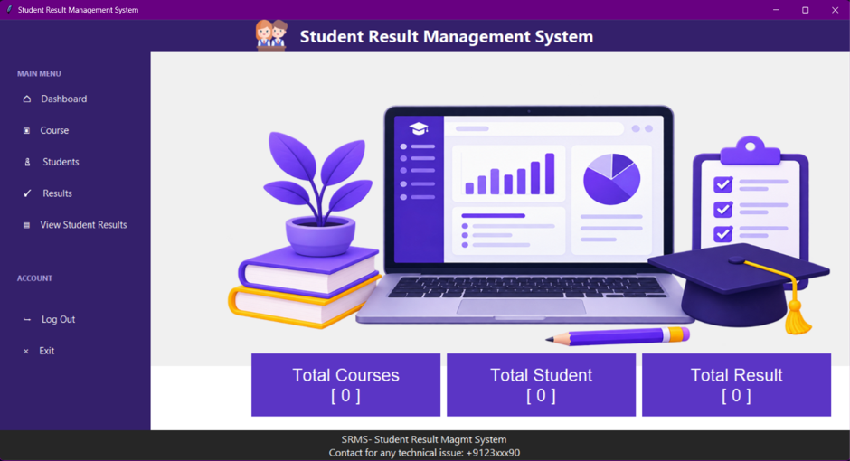

# 🎓 Student Result Management System

A simple **Student Result Management System** built using **Python, Tkinter, and SQLite3**.

This project was created as a Python programming project to learn how a GUI application, database, and multiple Python modules can work together.

---

## 📌 About the Project

The Student Result Management System is a desktop application that helps manage basic student academic information.

The application has a dashboard from which different sections can be accessed:

* 📚 Course Management
* 👨‍🎓 Student Management
* 📝 Result Management
* 📊 View Student Results
* 🏠 Dashboard

The data is stored locally using **SQLite3**, so no separate database server is required.

---

## ✨ Features

### 🏠 Dashboard

* Simple and clean dashboard
* Navigation sidebar
* Displays total courses
* Displays total students
* Displays total results

### 📚 Course Management

* Add course information
* View course records
* Update course information
* Delete course records

### 👨‍🎓 Student Management

* Add student details
* View student records
* Update student information
* Delete student records
* Store student information in SQLite database

### 📝 Result Management

* Add student result information
* Manage result records
* Store results in the database

### 📊 Student Result Report

* Search/view student results
* Display result information in an organized format

---

## 🛠️ Technologies Used

| Technology             | Purpose                   |
| ---------------------- | ------------------------- |
| **Python**             | Main programming language |
| **Tkinter**            | GUI development           |
| **SQLite3**            | Database                  |
| **Pillow (PIL)**       | Image handling            |
| **Visual Studio Code** | Development environment   |

---

## 📂 Project Structure

```text
Student-Result-Management-System/
│
├── main.py
├── course.py
├── student.py
├── result.py
├── report.py
│
├── images/
│   ├── logo_p.png
│   ├── bg.png
│   └── ...
│
├── database/
│   └── ...
│
└── README.md
```

> The exact file and database names may vary depending on the final version of the project.

---

## ⚙️ Installation

### 1. Clone the repository

```bash
git clone https://github.com/YOUR-USERNAME/student-result-management-system.git
```

### 2. Open the project folder

```bash
cd student-result-management-system
```

### 3. Install Pillow

```bash
pip install pillow
```

Tkinter and SQLite3 are normally included with Python installations.

---

## ▶️ How to Run

Run the main Python file:

```bash
python main.py
```

The Student Result Management System dashboard should open.

From the dashboard, you can navigate to the different modules.

---

## 🖥️ Application Flow

```text
                 START
                   │
                   ▼
              Open Application
                   │
                   ▼
                Dashboard
                   │
        ┌──────────┼───────────┐
        ▼          ▼           ▼
     Course      Student      Result
     Module      Module       Module
        │          │           │
        └──────────┼───────────┘
                   ▼
             SQLite Database
                   │
                   ▼
          View Student Results
                   │
                   ▼
                  END
```

---

## 🗄️ Database

The project uses **SQLite3** for storing information.

The database is used for managing:

* Course records
* Student records
* Result records

The application performs basic database operations such as:

* **Create** – Add new records
* **Read** – Display stored records
* **Update** – Modify existing records
* **Delete** – Remove records

---

## 📸 Screenshots

### Dashboard

```markdown

```

## 🎯 Learning Objectives

This project helped me understand:

* Python GUI development
* Tkinter widgets
* Python classes and objects
* Functions and event handling
* Working with multiple Python files
* SQLite database connectivity
* SQL queries
* CRUD operations
* Image handling using Pillow
* Basic project structure

---
## 📄 License

This project is created for **educational and learning purposes**.

Feel free to explore the code and use it for learning.
